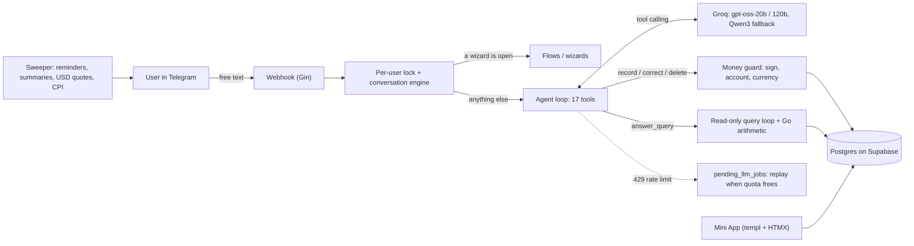
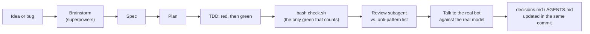

# Lopii — a personal-finance agent that lives in Telegram

**You type what you spent, the way you'd tell a friend. Lopii records it as a correct accounting
entry, answers questions about your money, and shows you where it went.**

> *"pagué el súper 24.500 con Mercado Pago y 3000 de nafta en efectivo"*
> → two expenses, each on the right account, in the right category, with the right sign. No form.


Lopii is a Go service **running in production** on Render, with Postgres on Supabase and LLMs
served by Groq. Since July 2026 it has been used by a small group of invited real users in
Argentina, keeping track of their own money in ARS and USD. The product is small on purpose. The
engineering behind it is what this repo is here to show.

| In production | |
|---|---|
| Live since | July 2026: first real user on 2026-07-01 |
| Real users | 7 invited users (the author, family and friends). Real accounts, real money |
| Logged LLM calls | 2,100+, each one traced with model, latency, tokens and outcome |
| Stack | Go · Gin · GORM · Postgres (Supabase) · Groq · Telegram webhook · templ + HTMX Mini App · Render |

---

## What Lopii does

Everything happens inside Telegram: a chat for **recording** and a Mini App for **reading**.
The bot speaks Argentine Spanish. The examples below are real message shapes.

**Record, with no form in the way**
- Expenses, income and transfers between your own accounts, several in one message:
  *"cobré el sueldo 1.200.000 y pasé 300 lucas al FCI"*.
- The account comes from **what you said**. If you name none, it falls back to your default
  account for that currency. If it's still ambiguous, Lopii asks with buttons.
- Buying USD is two linked legs (ARS out, USD in), so it never shows up as "spending".
- It stops before you record something wrong: an entry that would push an account below zero
  asks first (*Registrar igual / Reescribir / Falta registrar algo*).

**Correct and delete in plain language**
- *"no, eran 600"*, *"el débito del 4 de agosto era de Galicia"*, *"me devolvieron la mitad"*.
  Lopii finds the movement (ranking candidates by text and date) and applies the change as a
  structured diff. The arithmetic runs in Go, never in the model.

**Ask**
- *"¿cuánto gasté en súper en agosto?"*, *"¿cuánto transferí de FCI a Mercado Pago?"*,
  *"¿cuánto tengo en dólares?"*. A read-only tool loop queries the database. Totals, averages
  and splits are computed in Go, and the model only writes the sentence.

**Read (Telegram Mini App)**
- Overview, accounts, categories and evolution tabs with charts. Figures reconcile with the
  account balance, and every chart is either decorative or carries a text alternative. No JS
  framework and no build step: server-rendered `templ` + HTMX.

**Proactive**
- Weekly and monthly summaries, including how much you lived on per day. Expense reminders.
  Contextual tips with tappable questions. Daily USD quotes (`dolarapi.com`) and monthly CPI
  (`argentinadatos.com`) ingested in the background.

**Manage**
- Accounts, categories and reminders are configured by talking to the bot. There are no
  end-user commands; everything goes through the agent.

### Who it's for

Argentines who handle two currencies at once: pesos for daily life, dollars for savings. They
live on their phone and want to log a purchase in the seconds after paying. They are not the
kind of person who keeps a spreadsheet. Full product definition: [PRODUCT.md](PRODUCT.md).

---

## How it works



**The one design rule: the model owns the language, the app owns the accounting.**

- **Signs.** Every movement is signed and attributed to a real account, and a balance is always
  `SUM(amount)`. The LLM never decides a sign. The guard ([`internal/movement/guard.go`](internal/movement/guard.go))
  re-derives it from the movement type on every write.
- **Arithmetic.** A correction arrives as `field / op / value` (*"me devolvieron la mitad"* is
  `multiply 0.5`), and Go computes the result.
- **Account resolution.** The account comes from matching the user's own message (see
  [`internal/agent/seed.go`](internal/agent/seed.go)), not from the model's guess.
- **All-or-nothing writes.** A turn that can't complete writes nothing and asks instead, so a
  two-leg transfer can never split.
- **Money type.** Always `shopspring/decimal`. `float64` never touches an amount.

The full model: [docs/business-rules.md](docs/business-rules.md) · the reasoning behind each rule:
[docs/decisions.md](docs/decisions.md).

---

## The LLMs

Lopii runs on **Groq** through plain `net/http` tool calling, with no SDK and no agent framework.
Models are assigned per job, each with its own fallback chain:

| Job | Model | Fallback chain |
|---|---|---|
| Agent loop: picks one of 17 tools on every free-text message | `openai/gpt-oss-20b` | `gpt-oss-120b` → `qwen3` 27B |
| Drafting movements / in-turn classification | `openai/gpt-oss-120b` | — |
| Read-only query loop (questions about your money) | `openai/gpt-oss-120b` | `qwen3` 27B → `gpt-oss-20b` |
| Corrections, narration, intent classifier | `openai/gpt-oss-20b` | — |

Running an LLM product on Groq's rate limits shaped a lot of the design:

- **Groq's rate limits are per model** (measured from the response headers: 8,000 TPM per
  gpt-oss model). Models that run in the same turn are therefore kept on different models, and
  a test enforces it.
- **A rate-limited message is never dropped.** It goes into `pending_llm_jobs`, the user is told
  how long the wait is, and a drain worker replays it when quota frees up. The replay claims the
  job at its **first write**, so a deploy overlap can't record the money twice
  ([why](docs/decisions.md#why-a-replayed-job-is-claimed-at-its-first-write-not-before-or-after-the-replay-2026-09-19)).
- **Three layers of observability** (`request_traces`, `llm_calls`, `trace_id` across both, plus
  a Grafana dashboard) mean product questions get settled by querying production, not by
  arguing.
- **Evals against the real model** (`llm_eval`, `query_eval` build tags) cover the agent loop,
  category creation, Argentine number formats and the query engine. They fail loudly without
  an API key instead of skipping into a green that proves nothing.

---

## Engineering highlights: measured, then decided

Every non-trivial decision in [docs/decisions.md](docs/decisions.md) records the measurement,
the incident or the rejected alternative behind it. A few:

- **The model was quietly choosing the account.** Measured over the whole `llm_calls` table:
  30 of 43 expenses came back with an `account_id`, and in **0** of those 30 had the user named
  an account. The model was copying the first line of the prompt's account list, and users whose
  first account happened to be their default never noticed. Fix: on expenses the account is
  resolved from the user's words, and the model's id is ignored
  ([decision](docs/decisions.md#why-the-app-ignores-the-models-account_id-on-expenses-2026-08-22)).
- **An answer 15× off that looked plausible.** *"¿cuánto transferí este mes de FCI a Mercado
  Pago?"* answered $100.000 against $1.548.595,59 real, because a filter hid transfers. The fix
  had two traps, both measured before writing code: opening balances are also transfers, and the
  two legs of a transfer double any total.
- **The model can't turn "el lunes" into a date.** Four runs against the real model gave four
  wrong answers, even with the date table in the prompt. So relative dates are resolved in Go,
  and the model only transcribes dates the user spelled out. An eval keeps that case red on
  purpose, as evidence.
- **102 replays, 0 duplicates, and still a real hole.** A silent-failure audit found that the
  429 replay could record money twice during a deploy overlap. It had not fired yet. Fixed with
  claim-at-first-write and graceful SIGTERM handling before it ever did.

---

## How it was built

Lopii started as a **Google Sheets + Apps Script** bot (v1) and was rewritten as this Go service
(v2) once it outgrew the spreadsheet. The code in this repo was built by one engineer working
with **AI coding agents** (Claude Code), in a workflow designed to keep agent-written code
honest.



- **Spec-driven + test-driven.** Every change goes through the
  [superpowers](https://github.com/obra/superpowers) skills: brainstorming → written spec →
  implementation plan → TDD (watch the test fail first) → verification. A bug fix starts with a
  red test built from the **literal production message** that broke; those tests stay in the repo.
- **A harness built for agents, not just humans.** [AGENTS.md](AGENTS.md) holds the
  conventions and the accounting model. **16 packages carry their own `AGENTS.md`** listing only
  the traps that compile fine and behave wrong (for example
  [internal/agent/AGENTS.md](internal/agent/AGENTS.md)). The four packages where a mistake
  silently records money wrong are loaded into every agent session. Repo-specific subagents
  ([`.claude/agents/`](.claude/agents)) carry the money rules into locate/edit/review work.
- **The harness tests itself.** [`internal/harness`](internal/harness/harness_test.go) fails
  the build when a doc cites a symbol that no longer exists, when a link or anchor breaks, when a
  doc claims a package count that isn't true, or when a comment survives in Go source. Comments
  rot and tests don't, so the "why" lives in test names and in `docs/decisions.md`.
- **One gate.** `bash check.sh` (build, vet, errcheck, test suite) is the completion evidence,
  locally and in CI, plus `govulncheck`. "It looks right" doesn't count.
- **Tested with real users.** Features ship to the invited users, and their real messages
  become the next test case. Talking to the bot against the real model found 9 bugs that three
  written spec reviews had missed. Since then, real-model testing is a step, not a nice-to-have.

### By the numbers

| | |
|---|---|
| Go test functions | **1,030** across 166 test files |
| Test code vs. production code | **27.8k** lines of tests for **20.4k** lines of Go |
| Test suites | unit (default) · `integration` · `conv_test` (Postgres) · `llm_eval` · `query_eval` (real Groq) |
| Migrations | 36 (Goose, applied at startup) |
| History | 900+ commits since 2026-06-12, about 100 merged PRs in the private repo |

---

## Where to look

| If you're evaluating… | Start here |
|---|---|
| **Product thinking** | [PRODUCT.md](PRODUCT.md) (users, principles, what was deliberately *not* built) · [DESIGN.md](DESIGN.md) |
| **Go backend / correctness** | [internal/movement](internal/movement) (the money guard) · [internal/pendingjob](internal/pendingjob) (429 queue, idempotent replay) · [docs/business-rules.md](docs/business-rules.md) |
| **LLM / agent engineering** | [internal/orchestrator/agent_tools.go](internal/orchestrator/agent_tools.go) (tool schemas) · [internal/agent](internal/agent) (the loop, reference resolution) · the `*_eval_test.go` files in `internal/orchestrator` |
| **AI-assisted engineering process** | [AGENTS.md](AGENTS.md) · [internal/harness/harness_test.go](internal/harness/harness_test.go) · [check.sh](check.sh) · [docs/decisions.md](docs/decisions.md) |

## Run it locally

Go 1.26+, Docker (local Postgres), a Telegram bot token, a Groq API key, and a public HTTPS URL
for the webhook. Step by step: [docs/dev-setup.md](docs/dev-setup.md). Working on the code, as a
human or an agent: read [AGENTS.md](AGENTS.md) first.

```bash
docker compose up -d   # Postgres
bash check.sh          # build + vet + tests
```

## About this repository

This is a public mirror of the private working repository, regenerated from it on every change.
The mirror drops the v1 spreadsheet and the per-session spec/plan scratch from all of history,
and replaces real names in fixtures and commit messages. Commits, dates and messages are
otherwise the real ones.

Built by **Nahuel Pairola** · Argentina.
